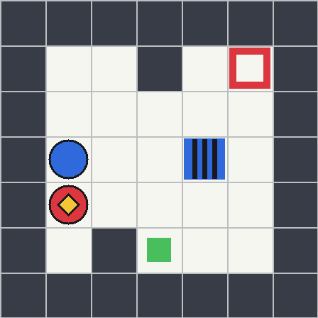

# SwitchDoor

SwitchDoor is a deterministic 7×7 visual environment for studying hidden-rule
induction, representation learning, world models, planning, and control.

The world contains an agent, walls, a goal, two colored switches, and two
colored doors. A hidden two-factor rule determines which door each switch
controls and whether interaction opens or toggles that door. The environment
supports exact symbolic replay, dependency-free PNG rendering, deterministic
procedural generation, paired C0–C3 counterfactual roots, and auditable dataset
export.



## Install

```bash
git clone https://github.com/zixuangui-rgb/SwitchDoor.git
cd SwitchDoor
python -m pip install -e .
```

The package has no runtime dependencies. Python 3.10 or newer is required.

## Quick start

```python
from switchdoor import C1, GenerationConfig, SwitchDoorEnv, build_scenario_group

group = build_scenario_group(GenerationConfig(seed=7), candidate_index=0)
env = SwitchDoorEnv(group.shell.spec, C1)

for action in group.shell.actions:
    transition = env.step(action)
    print(action.value, transition.changed, transition.after.to_dict())

png_bytes = env.render_png(renderer="salient", resolution=448)
```

The environment intentionally does not impose a reward function. Downstream
tasks can define rewards from exact transitions without changing world
semantics. A privileged `oracle_shortest_plan` helper is available when a task
needs a deterministic planning upper bound.

## Generate a paired dataset

```bash
switchdoor generate \
  --output generated/train \
  --roots 32 \
  --seed 2026 \
  --split train \
  --layout-family near \
  --action-family core

switchdoor audit --dataset generated/train
```

Each root fixes the layout, initial state, and action sequence, then replays
that shell under all four hidden rules. Exported data is separated into:

- `public.jsonl`: frame paths and actions;
- `labels.jsonl`: the two hidden rule factors;
- `private.jsonl`: geometry and exact symbolic state traces;
- `frames/`: content-addressed deterministic PNGs;
- `dataset_receipt.json`: generation parameters, counts, and integrity hashes.

Existing output directories are never overwritten.

## Canonical rules

| ID | switch mapping | door response |
|---|---|---|
| C0 | same color | open only |
| C1 | same color | toggle |
| C2 | cross color | open only |
| C3 | cross color | toggle |

Movement into a wall, boundary, or closed door is a no-op. `INTERACT` is a
no-op unless the agent stands on a switch. Full semantics and generator
guarantees are specified in [docs/environment-spec.md](docs/environment-spec.md).

## Repository scope

This repository contains the environment only. It deliberately excludes JEPA,
language models, projectors, training recipes, and experiment-specific scoring.
Those systems may consume SwitchDoor observations without becoming part of the
environment's state-transition truth.

## Development

```bash
python -m pip install -e '.[test]'
ruff check .
ruff format --check .
pytest -q
```

The transition implementation in `src/switchdoor/core.py` is the sole rule
source. Changes to its semantics require corresponding specification and
regression-test updates.
